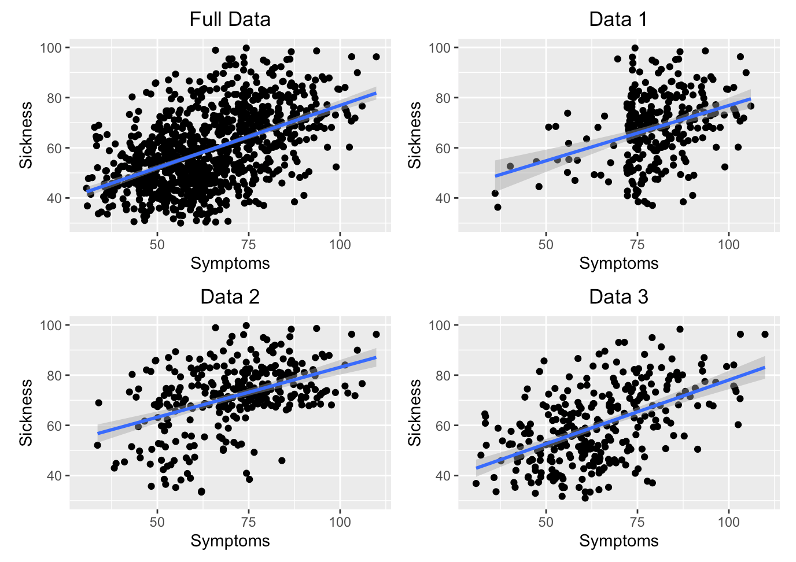
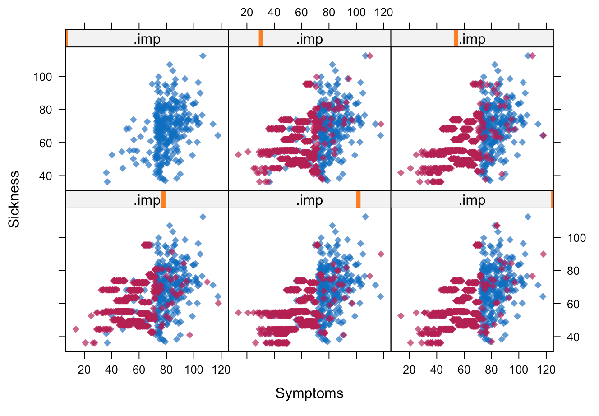
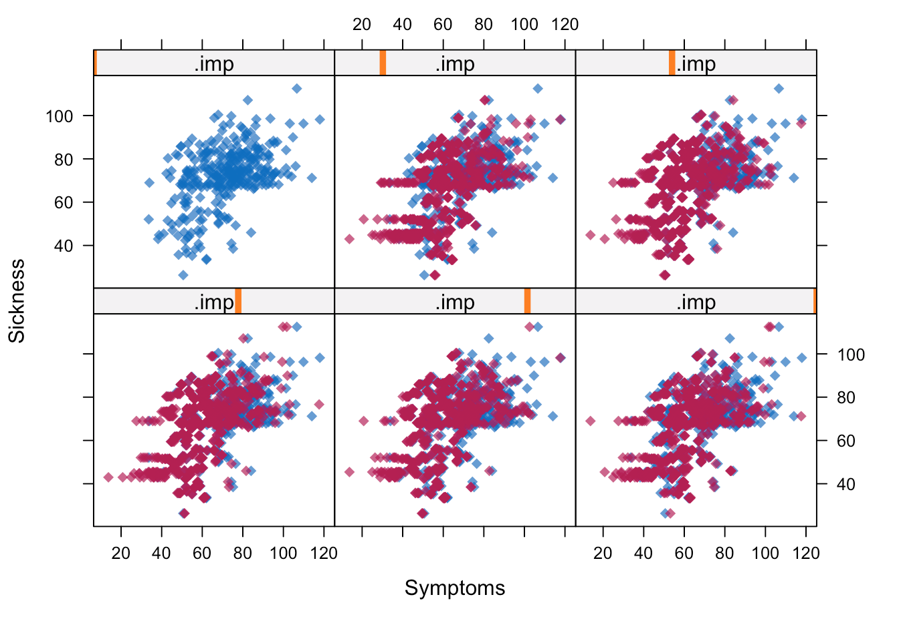
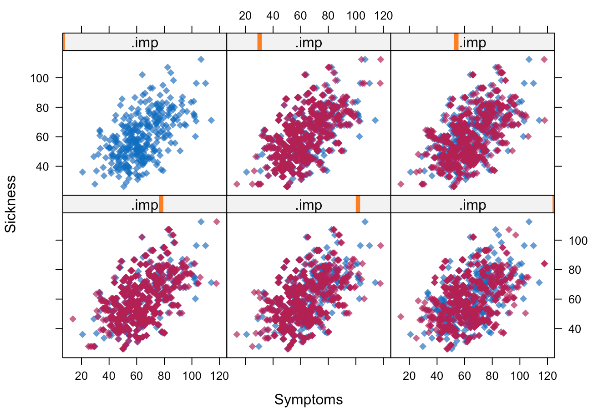

# Disease Detection

### Overview

This project explores how to deal with different types of missing data: Missing Completely At Random (MCAR), Missing At Random (MAR), Missing Not At Random (MNAR).
It explores methods of: mean substitution, regression imputation, and multiple imputation. This enables us to observe how missing data may skew knowledge about a dataset.
We use a context of disease detection, in which we try to predict whether individuals require hospitalization based on their sickness level. More detail about the data is described below.

 

### Data

The dataset contains two columns: symptoms and sickness. These two variables are continuous variables that demonstrate the severity of an individual's symptoms and sickness, respectively.
Individuals who display sickness value greate than 60 requires hospitalization.

The data consists of 1,000 observations displaying some possibility of disease from the population of a given county.

|File Name|Description|
|--|--|
|Data1.csv|csv file with MAR data|
|Data2.csv|csv file with MNAR data|
|Data3.csv|csv file with MCAR|
|FullData.csv|Simulated full population data of a country, contains no missing data (theoretically the best dataset)|
|TestData.csv|Contains the sickness and symptoms of the adjacent country of FullData|

 

### Analysis

The higher level overview of the code is as follows:

- Perform linear regression on `FullData.csv` to predict hospitalization (theoretical best).
- Generate linear regression plots to determine what type of missing data each dataset is.
- Perform linear regression on each dataset with missing data (`Data1.csv`,`Data2.csv`,`Data3.csv`) to predict hospitalization.
- We compare predictions with true number of hospitalization.
- Perform mean substitution and observe performance
- Perform regression imputation and observe performance
- Perform multiple imputation and observe performance

 

**Panel Figure of Regression**

Data3 (MCAR) : Individuals in the county are randomly tested irregardless of symptoms or sickness.

Data1 (MAR): Individuals with higher symptoms are tested more frequently than individuals with lower symptoms.

Data2 (MNAR): Individuals with known contact with infected individuals are tested more often than those without. This has the effect of testing individuals with high sickness more often.

Impact of missing data on prediction on adjacent county (test data):

Data1 (MAR): because most people with high symptoms are in the dataset, the prediction for sickness in the missing data may result in higher values. This is because, generally, people with higher symptoms have higher sickness, so having most of the data with higher symptoms will result in a model that predicts higher sickness. However, the inaccuracy will not be as severe as a dataset with data missing not at random.

Data2 (MNAR): because individuals with high sickness are tested more often, the prediction of sickness on new data will be higher. Thus, predictions will be very inaccurate, and overpredicted.

Data3 (MCAR): missing data will reduce the accuracy of the prediction, but will not severely impact as much as the MNAR and MAR data.

**Prediction**

|True Number|Data1 (MAR)|Data2 (MNAR)|Data3 (MCAR)|
|-----------|-----------|------------|------------|
|344        |497        |879         |426         |

The true number of hospitalization was 344. However, the MAR data predicted 497, MNAR predicted 879, and MCAR predicted 426. Thus, the datasets with missing data predicted much higher sickness and hospitalization.

Observing the coefficients of the models, the MAR and MNAR models have much higher intercepts with values of 33.25 and 41.95, respectively. These are greater than the intercepts of the full data and MCAR who have values of 26 and 25, respectively. This may be because since MNAR and MAR have majority of their data points with higher sickness, the intercept will be higher when fitting the model.

On the other hand, the MAR and MNAR models’ symptoms coefficients are less than the full data and MCAR. This may be because MCAR and the FullData have data ranging from low and high values, thus the linear regression would capture the greater upward slope. However, the MAR and MNAR contain mostly high sickness values, thus the change in slope is expected not to be as high. 

 

**Mean Substitution Performance**

|True Number|Data1 (MAR)|Data2 (MNAR)|Data3 (MCAR)|
|-----------|-----------|------------|------------|
|344        |1000       |1000        |441         |

The mean substitution method performs terribly in the predictions. The MAR and MNAR data predicts that all of the patients will be hospitalized, compared to the true value of 344. This is because the mean sickness of the MAR and MNAR dataset is 68.58 and 71.9, respectively. Thus, when we substitute the missing values with these high mean values, the linear regression will fit such that it predicts high values.

Observing the coefficients, the MAR and MNAR datasets have intercepts of 64.427 and 63.873, respectively. Moreover, the coefficient of symptoms are positive, with 0.06519 and 0.1259. Thus, all patients will be hospitalized regardless of their symptoms, because the prediction value will always be greater than 60.

**Regression Imputation Performance**

|True Number|Data1 (MAR)|Data2 (MNAR)|Data3 (MCAR)|
|-----------|-----------|------------|------------|
|344        |497        |879         |426         |

We obtain the same prediction as the implicitly list-wise/pair-wise deletion model. This is because, we substituted values based on a linear regression model on the existing data. Therefore, when we create a regression model in the data with the imputed values, it will result in the same linear model.

However, it is important to note that this will not always be the case. It is equal in this particular project, because we only have one predictor variable, thus resulting in the same model.

**Multiple Imputation Performance**

We generate plots to observe multiple imputation

The plots look reasonable.
The MNAR plot have a lot of points concentrated on the higher sickness values. 
In comparison, the MCAR plot have points fairly scattered throughout. 
The MAR plot have imputed points roughly around the blue points.

 

We manually generate the final regression functions based on the summary of the pooled results 
We construct linear models with the multiple imputation dataset and generate predictions on test data
Details in `disease-detection.Rmd`

|True Number|Data1 (MAR)|Data2 (MNAR)|Data3 (MCAR)|
|-----------|-----------|------------|------------|
|344        |463        |867         |439         |

 

**Findings**

Mean substitution method performs very poorly for MAR and MNAR datasets. Specifically, for MNAR dataset, values are missing based on the dependent variable itself. In this case, data with lower sickness values were missing. Therefore, the mean sickness value was very high. Similarly, it is expected that patients with high symptoms will have higher sickness. Thus, for the MAR dataset, since most data had high symptoms, the mean sickness value would be high. Thus, substituting the mean value will be problematic, since the regression would fit to data points with high sickness values. As we observed in the lab, this resulted in all the patients being hospitalized. For the MCAR dataset, the mean substitution performed fairly okay. This is because the missing data is not related to Symptoms or Sickness itself, the mean value would not be overly high like the MNAR and MAR dataset.

The multiple imputation method helped improve the estimates overall. Specifically, the missing dataset models tended to overestimate the hospitalization proportion. However, the multiple imputation improved on such overestimation by generating multiple copies of stochastic imputation and pooling the results.

### Files

|File Name|Description|
|--|--|
|Data|folder that contains datasets used in this project|
|disease-detection.Rmd|R markdown file that contains code|

 

### Acknowledgements

This lab was designed by Dr. Bonifonte of Denison University who has provided the necessary materials and data.
