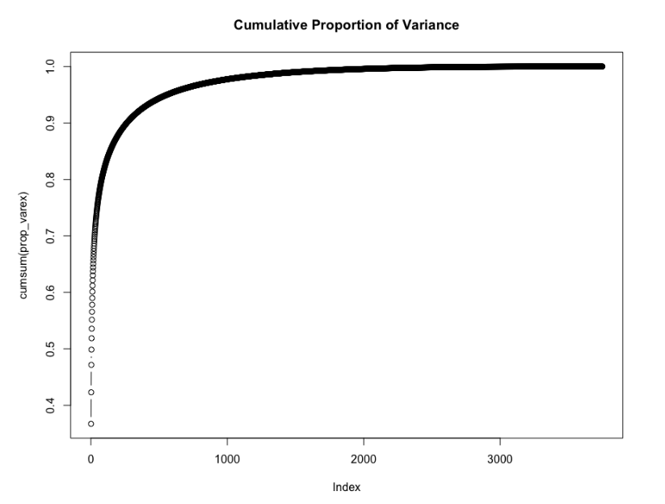
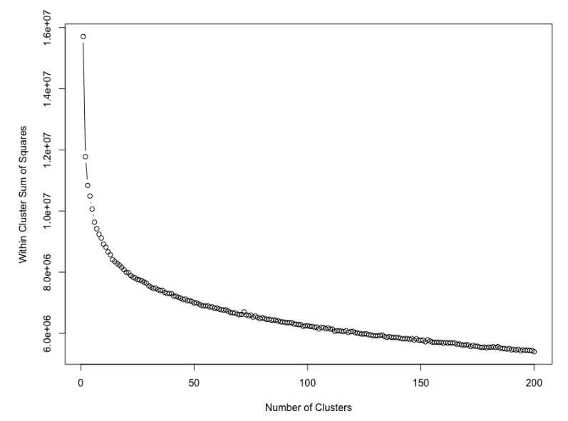
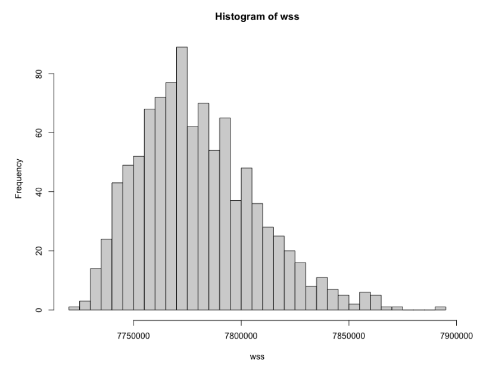
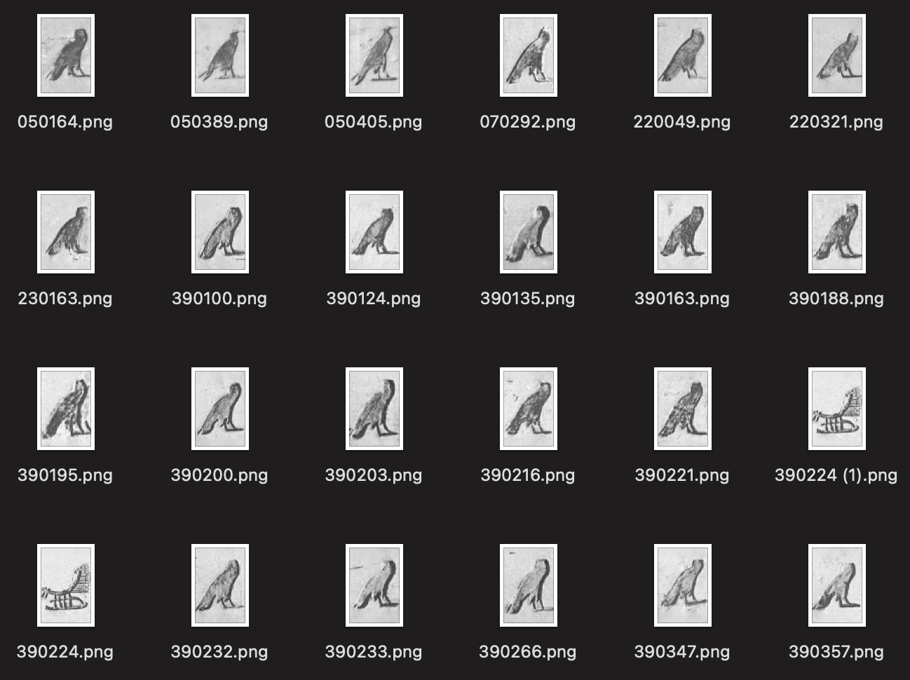

# Hieroglyphics Classification

### Overview

This project uses K-Means-Clustering to cluster similar hieroglyphics characters. Principal components were generated, and the number of principal components that captures 95% of the variance in the data were used. The principal components were used to train the K-Means-Clustering model. The model was optimized by plotting the within cluster sum of squares of different cluster numbers.

### Data

The data set contains 4,411 hieroglyphs found in 10 different pictures derived from the book “The Pyramid of Unas” (Alexandre Piankoff, 1955). The dataset is compiled by Morris Franken, complementary to the paper titled “Automatic Egyptian Hieroglyph Recognition by Retrieving Images as Texts” (ACM Conference on Multimedia, 2013). The images were processed in a way such that it fits a 50x75 pixel dimension. Only a few of the 4,411 hieroglyphs were uploaded to this repository to provide examples, while not exceeding the 100mb upload limit.

### Analysis

Roughly between 500 and 600 principal components explain 95% of the variance in the data (when examining the data, the exact value is 557).

K-Means Clustering on the principal components data was run with varying number of cluster numbers.

25 clusters is roughly the elbow of the plot. In other words, adding more clusters than 25 may not be efficient. The within cluster sum of squares does not reduce enough considering the extra computing required when adding another cluster after 25 clusters.

The number of initial configuration was optimized by observing a histogram plot of the within sum of squares. Sufficient number of initial configuration is needed to find the optimal solution. However the value cannot be too high to prevent computing more than what is necessary.

The most frequent count is around 90 which has a fair within sum square. Therefore the random start is set to 100 so that there is a fair chance of obtaining a good solution.

### Results

As seen in the example of the cluster formed, bird figures were generally clustered together. There are also other clusters that group similar images together, while some clusters feature some miscellaneous images grouped together.

New images could be assigned to the clusters by calculating the euclidean distance between the centers of the clusters and the new image. The new image will be classified to the cluster with the minimum distance. Details is provided in code file.

### Files

|File|Description|
|----|-----------|
|||
|| |
| | |

