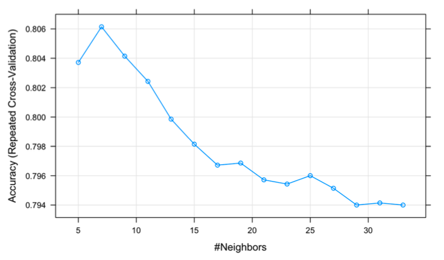
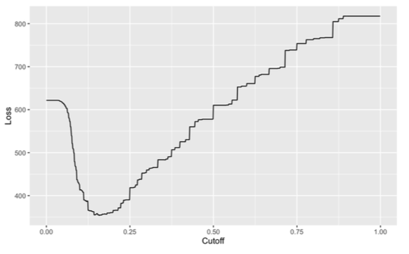

# Movie Recommendation System

### Overview

**Part I**: principal components were generated and used in K-Nearest-Neighbors algorithm. Explores content-based prediction method.
It compares the movie of interest to similar movies the user has rated to generate a prediction

**Part II**: Uses collaborative filtering methods. The user of interest is matched to other similar users based on their ratings behavior.
We also simulate a hypothetical *business problem* where users pay $3 to digitally rent a specific movie for 24 hours.
There is a $0.5 profit on each user that watches that movie. Ads can be sent for $0.20 to specific users. We strategize to target specific users who have not yet watched TPB to maximize profit.

### Data

|File Name|Description|
|--|--|
|MovieGenome.csv|contains rows of movies and 49 variables (columns) of their features|
|ratings.csv|data that shows how each user rated movies watched|
|train_movies.csv|training data set showing how each user (row) rated movies watched|
|test_movies.csv||

Note) `ratings.csv` originally contains 15,724,428 rows. But dataset uploaded to this repository only contains 100 rows just to display as sample.
Data source: MovieLens, a movie recommendation service.

### Part 1

The high level approach of the code for part 1 is as follows:

- Conduct principal component analysis to determine how many principal components captures 95% of the variance. Was roughly 450.
- Generate dataframe that presents distance between movie of interest and every other movie.
- Reduce size of data by only including ratings of users that have rated movie of interest.
- Find optimal value of *k* for k-nearest-neighbors algorithm. Compare to user average and global average. Figure presented below.

We find that roughly 8 closest movies are best at making predictions. The predictions of the knn model is performing fairly well, with MSE reaching roughly 0.5 at the lowest point. It is also performing better than the global and user average. The MSE means that the squared difference between the true rating and predicted rating is roughly 0.5

### Part 2

The high level approach of the code for part 2 is as follows:

- Convert train and test datasets into binary data (1 if user saw movie, 0 otherwise)
- Perform K-Nearest-Neighbors with fixed *k*
- Hyperparameter tuning for *k*: try different *k* values and observe performance. Figure shown below.
- Evaluate performance using a confusion matrix. Figure shown below.
- Generate predictions of probabilities users will watch the specific movie.
- We create a loss function to determine which cutoff returns greatest profit.
- Fit testing data

We observe that the model with the best prediction is when *k* is 7.

The confusion matrix below is used to evaluate performance. 

| |Reference Negative|Reference Positive|
|--|--|--|
|Prediction Negative |5251 | 1162|
|Prediction Positive |65 |522 |

The accuracy is 0.8247. It means that 82.47% of the predictions are correct (true positive, true negative).

The kappa is 0.383. It means that our model’s accuracy is moderately better than if it was guessing by random chance.

The sensitivity is 0.9878. It means that given a customer rents the movie, the model predicts the customer will rent it for 98.78% of the cases (predicts true positive correctly).

The specificity is 0.3100. It means that given a customer does not rent the movie, the model predicts the customer would not rent it 31% of the cases (predicts true negative correctly).

In the context of our problem, it is good that we have a high sensitivy because we are able to generate profit from each targeted audience. However, if we have a low specificity, it means that we are wasting budget on advertisement. Thus, it may be worth exploring if there are ways to reduce the specificity, while maintaining this level of sensitivity.

We determine that the cutoff that minimizes loss is 0.158, and use that cutoff when generating the test data confusion matrix.

| |Reference Negative|Reference Positive|
|--|--|--|
|Prediction Negative |1927 | 252|
|Prediction Positive |377 |430 |

TP: 430 * 0.3 (0.5 rent profit - 0.2 ad cost) = 129, FP: 377 * -0.2 = -75.4 Total Profit: $53.6 (129 - 75.4)

Baseline: if we sent ads to everyone the cost is $597.2 (2986*0.2). The profit we gain from people who actually watched would be $341 (0.5 * 682). So the profit would be, -256.2, which is a loss.

Thus, compared to the baseline, our model’s profit is greater.

FP: 377 * 0.2 = $75.4 would be wasted on advertisements. 

FN: We would miss 252 users. Thus, we will lose: 252 * 0.3 (0.5 rent profit - 0.2 ad cost) = $75.6

### Files

|File Name|Description|
|--|--|
|Data|folder that contains datasets used in this project|
|movie-recommendation.Rmd|R markdown file that contains code|

### Acknowledgements

This lab was designed by Dr. Bonifonte of Denison University who has provided the necessary materials and data.

