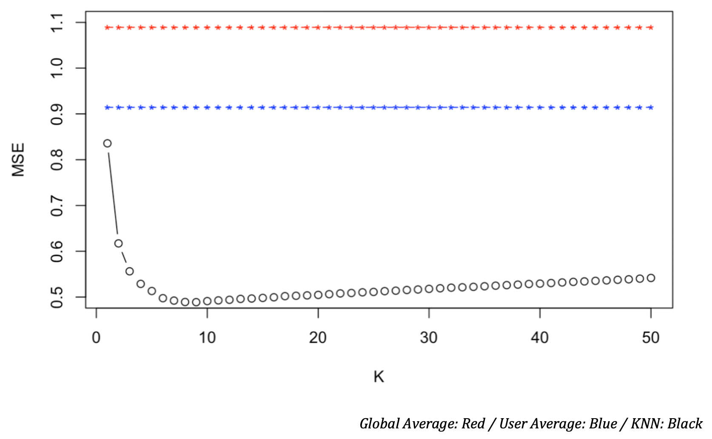

# Movie Recommendation System

### Overview

**Part I**: principal components were generated and used in K-Nearest-Neighbors algorithm. Explores content-based prediction method.
It compares the movie of interest to similar movies the user has rated to generate a prediction

**Part II**: Uses collaborative filtering methods. The user of interest is matched to other similar users based on their ratings behavior.

### Data

|File Name|Description|
|--|--|
|MovieGenome.csv|contains rows of movies and 49 variables (columns) of their features|
|ratings.csv|data that shows how each user rated movies watched|
|train_movies.csv|training data set showing how each user (row) rated movies watched|
|test_movies.csv||

Note) `ratings.csv` originally contains 15,724,428 rows. But dataset uploaded to this repository only contains 100 rows just to display as sample.
Data source: MovieLens, a movie recommendation service.

### Part 1

The high level approach of the code for part 1 is as follows:

- Conduct principal component analysis to determine how many principal components captures 95% of the variance. Was roughly 450.
- Generate dataframe that presents distance between movie of interest and every other movie.
- Reduce size of data by only including ratings of users that have rated movie of interest.
- Find optimal value of *k* for k-nearest-neighbors algorithm. Compare to user average and global average. Figure presented below.

### Part 2

### Files

|File Name|Description|
|--|--|
|Data|folder that contains datasets used in this project|
|movie-recommendation.Rmd|R markdown file that contains code|

### Acknowledgements

This lab was designed by Dr. Bonifonte of Denison University who has provided the necessary materials and data.

