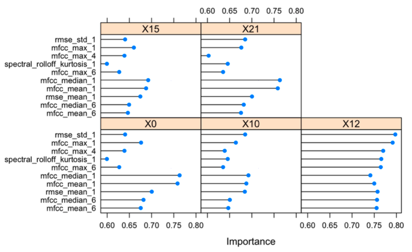
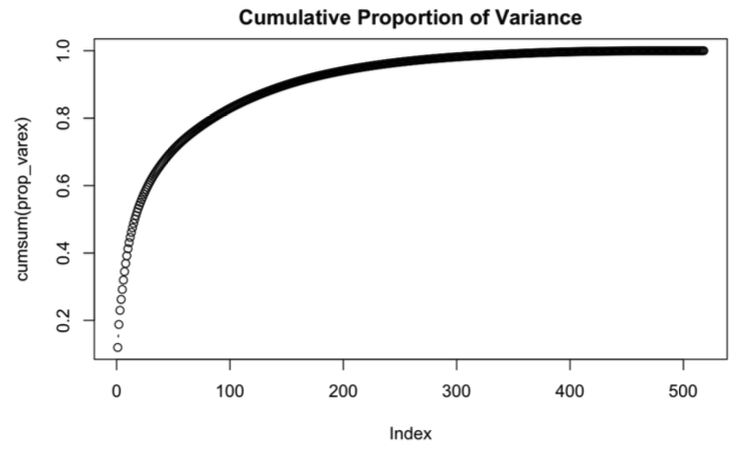

# Spotify Genre Identification Project

### Overview

Identifying whether a song is Rock, Electronic, Hip-Hop, or Pop from musical features of the audio. **Linear discriminant analysis** and **quadratic discriminant analysis** models was used to answer the following questions:

1. If we are limited to a single feature to decide the genre, what decisions should we make and how good will our classifications be?

2. If we can consider multiple features, what decisions should we make and how good will our classifications be? How many features do you need to adequately classify genres?

### Data

|File Name|Description|
|--|--|
|features.csv|file with music tracks(rows) and 518 features of audio (columns)|
|genres.csv|file displaying genre information: genre_id, parent genre, genre title, top_level genre id|
|tracks.csv|contains information about each song such as genre, title, album, comments, genre_id|

Note) `tracks.csv` file size exceeds github upload limit, so only first 100 rows are shown in file uploaded to this repository as a sample.

 

**Genre Code Table For This Project:**

|Genre Code|Genre Title|
|----------|-----------|
|0|Other|
|10|Pop|
|12|Rock|
|15|Electronic|
|21|Hip Hop|

 

### Analysis

The higher level overview of the code is as follows:

- Process track genre into broader category of Hip Hop, Pop, Rock, and Electronic.
- Perform data cleaning of relevant columns (i.e. remove brackets and empty spaces from genre column, comma split)
- Merge genres and features dataframe by id
- Identify important variables. Figure presented below under *Single Feature Model*
- Use linear discriminant analysis to predict genre
- Construct confusion matrix to evaluate LDA model
- Use quadratic discriminant analysis using principal components to predict genre
- Construct confusion matrix to evaluate QDA model

 

Figure of variable importance.

The plot above depicts that mfcc_median_1 is the most important for all the genres except for rock. Thus, if we were to use a single variable, using mfcc_median_1 may result in a more accurate model.

**LDA Confusion Matrix**

|             |Reference 0|Reference 10|Reference 12|Reference 15|Reference 21|
|-------------|-----------|------------|------------|------------|------------|
|Prediction 0 |6915       |1520        |2593        |3943        |676         |
|Prediction 10|0          |0           |0           |0           |0           |
|Prediction 12|2824       |2010        |5839        |3841        |1321        |
|Prediction 15|0          |0           |0           |0           |0           |
|Prediction 21|0          |0           |0           |0           |0           |

As observed by the confusion matrix above, the model with only one feature classifies the tracks into either 0 (“other genres”) or 12 (rock). 
Therefore, the model performs very poorly since it fails to classify pop, electronic, and hiphop genres. 
The Kappa value is also very low, with a value of 0.1639, which means the model performs only slightly better than if it was randomly guessing. 
The accuracy may appear to be moderate with a value of 0.4, but this value may be deceptive because 6915 are correctly characterized as “other”, and the model only predicts “other” and “rock”.

 

**PCA Plot**

Roughly 250 principal components explain 95% of the variability in the data. Thus we use the first 250 principal components to construct the QDA model.

 

**QDA Confusion Matrix**

|             |Reference 0|Reference 10|Reference 12|Reference 15|Reference 21|
|-------------|-----------|------------|------------|------------|------------|
|Prediction 0 |6265       |984         |1671        |1653        |149         |
|Prediction 10|296        |349         |241         |131         |63          |
|Prediction 12|1568       |1286        |5290        |933         |238         |
|Prediction 15|1452       |780         |1095        |4664        |739         |
|Prediction 21|158        |131         |135         |403         |808         |

The accuracy of the prediction is 0.5519, which means approximately 55% of the predictions are correctly classified. The Kappa value is 0.39, which means the model performs moderately better than when predictions were randomly generated.
The sensitivity of class 0 (“other genres”), 12 (rock), 15 (electronic) are approximately 0.6. Thus, the true positive rate is moderately well. Pop music, however, has a very low sensitivity, which means pop tracks are not correctly classified as pop for the most part.
The specificity is fairly high, with values being roughly 0.8 and above. This means that the true negative rate is roughly 80% and above for all the genres.
In sum, the model performs fairly well with high specificity and moderate sensitivity (except for pop).

 

### Files

|File Name|Description|
|--|--|
|Data|folder that contains datasets used in this project|
|music-genre-identification.Rmd|R markdown file that contains code|

 

### Acknowledgements

This lab was designed by Dr. Bonifonte of Denison University who has provided the necessary materials and data.
